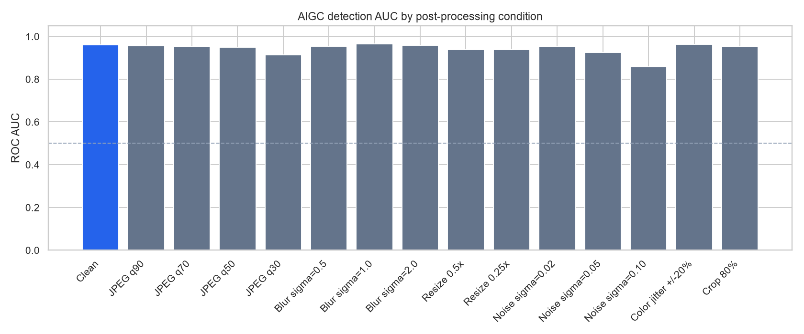
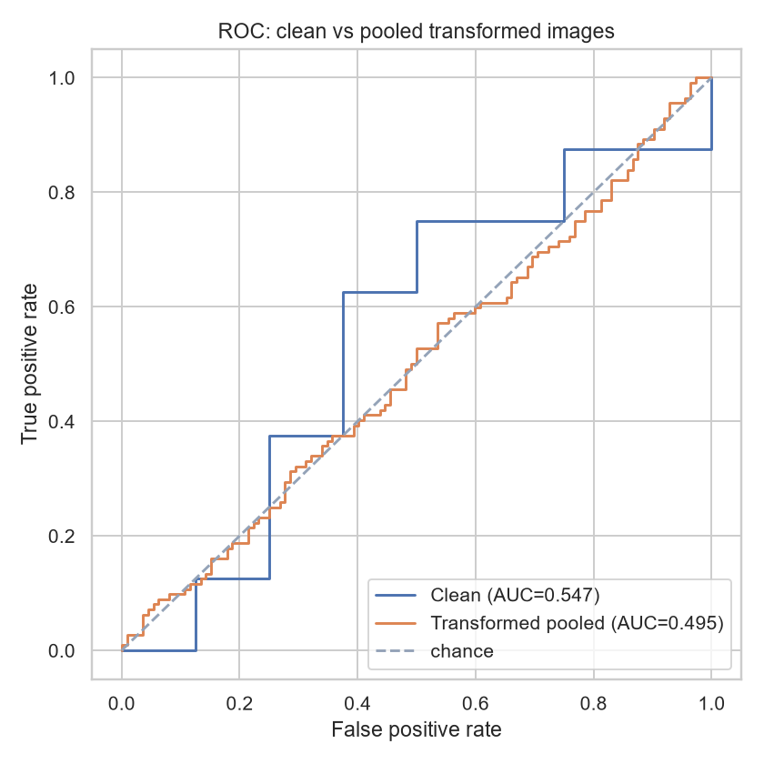

# UM AI Image Detector

Local web app and CLI that score stills as **real**, **filtered / edited**, or **AI-generated**. The model is a two-branch detector (CLIP ViT-B/32 semantic + FFT CNN) fused by a small MLP.

This is **not a hosted website**. After you clone the repo, run the server on your own computer and download the trained weights (GitHub cannot store the 338 MB checkpoint).

---

## Setup (clone → run)

Need **Python 3.10+**. A GPU is optional; CPU works.

### 1. Clone and create a virtual environment

**Windows (PowerShell or Command Prompt)**

```bat
git clone https://github.com/KahYengP/ai-image-detector.git
cd ai-image-detector
python -m venv .venv
.venv\Scripts\activate
```

**macOS / Linux**

```bash
git clone https://github.com/KahYengP/ai-image-detector.git
cd ai-image-detector
python -m venv .venv
source .venv/bin/activate
```

You should see `(.venv)` at the start of the terminal line after activate.

### 2. Install Python packages

With `.venv` still active:

```bat
pip install -r requirements.txt
```

The first Analyze also downloads `openai/clip-vit-base-patch32` from Hugging Face (~350 MB) if it is not already cached.

### 3. Download the trained model (`outputs/best.pt`)

The checkpoint is **not** in git. Download it from Google Drive (anyone with the link can view/download):

**[Download best.pt](https://drive.google.com/file/d/1oa6eWCfhXICZx3Kkt0JYn-JHABARJgFD/view?usp=sharing)**

1. Open the link and click **Download**.
2. Confirm the file is about **338 MB** (345,520 KB). If it is 0 KB or a few bytes, the download failed — try again from the Drive page, not a blank file you created yourself.
3. Rename it to `best.pt` if the browser added extra text.
4. Put it here (create the `outputs` folder if needed):

```text
ai-image-detector/outputs/best.pt
```

Do **not** create an empty `best.pt`. PyTorch will fail with `Ran out of input`.

In `config.yaml`, `paths.checkpoint` must stay:

```yaml
checkpoint: outputs/best.pt
```

### 4. Start the website

Keep `.venv` active. Leave this terminal open while you use the app.

**Windows**

```bat
.venv\Scripts\activate
python web\server.py
```

**macOS / Linux**

```bash
source .venv/bin/activate
python web/server.py
```

In a browser open **http://127.0.0.1:8765**

- Drag in one or more JPG / PNG / WEBP / HEIC files, or click **Load Sample Test Batch**
- Click **Analyze Images**. Scores are saved to **`outputs/predictions.json`** (`image_path` and `pred` per image).
- Use **Original / Heatmap Scan / Noise Pattern / Split View** on the results page. Heatmap and noise are CSS inspection filters (`contrast` / `hue-rotate` / inverted grayscale), not Grad-CAM. Orange **!** markers are high local-contrast patches; hover them for a short explanation.

Stop the server with `Ctrl+C`.

If Windows says port 8765 is already in use, close the other server window, or in PowerShell run:

```bat
netstat -ano | findstr :8765
taskkill /PID <pid> /F
```

Then start `python web\server.py` again.

---

## Checkpoint (`outputs/best.pt`)

`*.pt` files are **gitignored** (GitHub file-size limit). Every clone must download the same weights.

| What | Detail |
| --- | --- |
| Path | `outputs/best.pt` |
| Size | about **338 MB** |
| Download | [Google Drive — best.pt](https://drive.google.com/file/d/1oa6eWCfhXICZx3Kkt0JYn-JHABARJgFD/view?usp=sharing) |

If Analyze fails with a path like `/Users/.../outputs/best.pt`, that machine still has an old absolute path in `config.yaml`. Set `checkpoint: outputs/best.pt` and keep the real file in this project’s `outputs/` folder.

---

## What the score means

The fused output `pred` is **P(AI)** in `[0, 1]`. Three display classes (also `result` in JSON):

| `pred` | `tier` | `result` |
| --- | --- | --- |
| `< 0.28` | `likely_real` | `real` |
| `0.28 – 0.74` | `filters_or_edited` | `filtered_or_edited` |
| `> 0.74` | `likely_ai_generated` | `AI` |

The website maps those scores into a 3-way probability breakdown, a confidence gauge, visual-signal bars, and rule-based explanations (semantic vs frequency plus CLIP / C2PA artifact cues). `pred` is a trained sigmoid, not a calibrated probability.

Analyze in the website also writes the same JSON to **`outputs/predictions.json`**.

---

## Clean vs transformed performance

Hold-out test set (**n = 43**: 27 photographic, 16 AI). Metric is binary **ROC AUC** (AI vs photographic). Each transformed row applies that degradation to the **same** 43 images.

| Condition | What changed | AUC |
| --- | --- | --- |
| **Clean** | no extra transform | **0.961** |
| JPEG q90 / q70 / q50 | mild–medium compression | 0.956 / 0.951 / 0.949 |
| JPEG q30 | heavy compression | 0.914 |
| Blur σ=0.5 / 1.0 / 2.0 | soft capture | 0.954 / 0.965 / 0.958 |
| Resize 0.5× / 0.25× | small pixels / thumbnail | 0.938 / 0.938 |
| Noise σ=0.02 / 0.05 / 0.10 | sensor grain | 0.951 / 0.924 / **0.859** |
| Color jitter ±20% | exposure / saturation shift | 0.963 |
| Center crop 80% | zoom / recomposition | 0.951 |
| **AUC_robust** | mean of all transformed rows | **0.941** |
| **Final score** | `0.50 × AUC_clean + 0.50 × AUC_robust` | **0.951** |

Most social-style transforms (JPEG, blur, resize, crop, mild noise) stay close to clean. The largest drop is **heavy Gaussian noise (σ=0.10)**.





Full numeric table: [`outputs/robustness_table.md`](outputs/robustness_table.md). Reproduce:

```bat
python evaluate.py
```

---

## Error analysis

Hold-out **clean** test set, **n = 43**. Counts below use a binary cut at `pred = 0.5` (photographic `y = 0` vs AI `y = 1`), which is how ROC AUC is computed. The website’s 0.28 / 0.74 bands are a separate display policy.

| Error | Count | Meaning |
| --- | --- | --- |
| False positives | **5** | photographic / edited stills with `pred ≥ 0.5` |
| False negatives | **2** | AI stills with `pred < 0.5` |

### Representative false positives (camera or edited stills scored too high)

| Image | `pred` | What happened |
| --- | --- | --- |
| `filtered_edited7-.png` | 0.859 | Beauty-filter / retouch still called **AI**. Semantic branch (0.84) dominates. |
| `real053.jpeg` | 0.781 | A **real** photo; both branches agree it looks synthetic. Hard FP. |
| `edited-filtered4.jpeg` | 0.615 | Edited photo; three-way label is `filters_or_edited`, not full AIGC. |
| `real057.jpeg` | 0.593 | Real photo in the middle band (`filters_or_edited` on the website). |

Typical pattern: **filters and unusual real photos** look like CLIP “render” cues. Raising `likely_ai_min` to **0.74** keeps the 0.59–0.62 cases out of the AI class; it does not fix `real053` (0.78).

### Representative false negatives (AI scored too low)

| Image | `pred` | What happened |
| --- | --- | --- |
| `ai-generated76.png` | 0.365 | AI parked in `filters_or_edited` (not `likely_real`; that needs `pred < 0.28`). |
| `ai-generated4.jpeg` | 0.473 | Same: under 0.5 binary, a miss; on the website it is the middle band, not “real”. |

Neither FN is a clean camera-photo call. The miss is **under-calling full AIGC**, not labeling AI as authentic.

### Trade-offs

- **Frequency vs JPEG/blur.** The FFT branch helps when generator upsampling is still visible. Heavy JPEG (q30) and blur flatten that spectrum, so more mass slides into `filters_or_edited`.
- **Semantic vs unusual reals.** CLIP is stabler under crop, jitter, and resize, but it can fire on real photos that sit far from its pretraining look (`real053`).
- **Middle band vs binary AUC.** The 0.28–0.74 band is a policy for filters / retouching / partial AI. It reduces “edited → AI” FPs at the cost of some true AI landing as edited instead of `likely_ai_generated`.
- **`pred` is not a calibrated probability.** It is a trained sigmoid used for ranking (AUC) and for those two cutoffs.

Full dump (copied example files + explanations): [`outputs/error_analysis.md`](outputs/error_analysis.md).

---

## CLI inference (required JSON output)

The core scoring script is `predict.py`. It takes an **image directory** and writes a **JSON file** with one object per image. Each object includes at least:

- `image_path` — filename / relative path of the image
- `pred` — confidence that the image is AIGC-generated, in `[0, 1]` (higher = more likely AI)

Default output path:

**`outputs/predictions.json`**

**Windows**

```bat
.venv\Scripts\activate
python predict.py --image-dir "train images" --output outputs\predictions.json
```

**macOS / Linux**

```bash
source .venv/bin/activate
python predict.py --image-dir path/to/images --output outputs/predictions.json
```

The full record also has `result`, `semantic_score`, `frequency_score`, `explanation`, `tier`, and `artifact_cues`. Open the file at:

```text
ai-image-detector/outputs/predictions.json
```

---

## Training

Current default data is **human-labeled stills** (`dataset.name: human` in `config.yaml`):

- `paths.human` → `train images`
- `paths.human_extra` → `test-images`

Labels come from **filename prefixes** (more specific first): `ai-generated_live`, `ai-generated_product`, `real_live`, `ai-generated`, `filtered_edited`, `edited`, `real_blur`, `real`. Edited / filtered names use a soft target near 0.5 so they land in the middle band.

```bash
# Fine-tune the existing checkpoint
python train.py --resume --reset-best --epochs 12 --lr 5e-5

# From scratch (uses paths.checkpoint as the save path)
python train.py
```

Optional public dumps (CIFAKE, SID_Set, WildFake) can still be wired through `config.yaml` `paths.*` and `dataset.name`. Do not train on the demonstration split (COCO val2017 + DALL·E Advanced); the WildFake loader skips those folders.

Useful flags: `--max-samples N`, `--clip-only`, `--no-aug`, `--device cpu` / `--device cuda`, `--resume`.

JPEG class-balance check (codec shortcut risk):

```bash
python -m data.balance_check
```

To regenerate the clean-vs-transformed table and charts after a new checkpoint:

```bash
python evaluate.py
```

Writes `outputs/robustness_table.md`, `outputs/error_analysis.md`, and `outputs/charts/` (`robustness_bars.png`, `roc_overlay.png`).

---

## Architecture

1. **Semantic branch** — CLIP ViT-B/32; last transformer block + post-LN trainable; 768 → 512.
2. **Frequency branch** — grayscale 2D FFT (log-magnitude) into a 4-layer CNN → 128-d.
3. **Fusion** — concatenate 640-d → 2-layer MLP → sigmoid `pred`. Auxiliary BCE on each branch.

Training-time augmentations (JPEG last) mimic redistribution: JPEG, blur, thumbnail resize, sensor noise, color jitter, center crop. Toggle families under `augmentations:` in `config.yaml`.

---

## Project layout

```text
config.yaml              # paths, thresholds, aug toggles
train.py
predict.py
evaluate.py
utils.py
web/
  server.py              # http://127.0.0.1:8765
  index.html
  styles.css
  app.js
  uploads/               # analyzed uploads (gitignored except .gitkeep)
train images/            # labeled stills (filename prefixes)
test-images/             # optional extra labeled stills
outputs/
  best.pt                # trained weights — download from Google Drive (not in git)
  predictions.json       # JSON list of {image_path, pred, ...} from CLI / web Analyze
data/                    # loaders + augmentations
models/                  # CLIP, FFT CNN, fusion, explanations
scripts/                 # eval helpers, smoke dataset, downloads
```

---

## Limitations

- The website only works on the machine running `python web/server.py` (`127.0.0.1`).
- Inspection views (heatmap / noise / split) are visual filters, not model heatmaps. Key-area dots mark high luminance variance, not Grad-CAM.
- A model trained on one generator or live-shopping look will not automatically transfer to every in-the-wild LoRA or app filter.
- Prefer native-resolution photos over 32×32 CIFAKE if you quote frequency-branch numbers.
- Always re-run the JPEG balance check on a new dump; a codec gap can inflate clean AUC.
